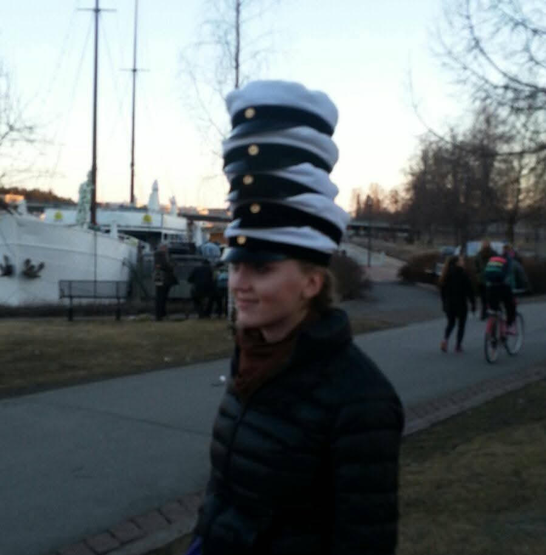

  

  

    

      <h2>About Me</h2>
      

      I am a PhD Candidate in Computer Science at Tulane University, where I study the intersection of algorithmic systems, causal inference, and social impact. My work focuses on understanding how automated decision-making systems can perpetuate or mitigate bias, and how we can design fairer, more accountable technologies. 
      

  

      

 

    

      <h2>Current Role</h2>
      
<strong>PhD Candidate</strong> 
      Computer Science, Tulane  
      Supervisor: Prof. Nicholas Mattei  
      2022 – Present

      

        My research draws from statistics, machine learning, and social science to answer questions like:
        <ul>
          <li>How can we distinguish between qualification-based disparities and unjust discrimination?</li>
          <li>What are the causal pathways through which bias enters algorithmic systems?</li>
          <li>How can we audit for fairness and transparency when we do not have audit data?
</li>
        </ul>
      

        

  

  

    

      <h2>Outside the Lab</h2>
      

Outside the lab, I spend a lot of time at the gym, drawing, or hanging out with our cats. I also have a long history with horses and I worked with them professionally in Europe, and they were a big part of my life for years. These days, I'm more of an observer than a rider, but I still enjoy watching and appreciating them whenever I get the chance. I also read a lot of non-fiction.
      

    

  

Feel free to reach out via sariola.disa@gmail.com

  <a href="/publications/" class="btn btn-outline-primary mx-2">Publications</a>
  <a href="/teaching/" class="btn btn-outline-primary mx-2">Teaching</a>

